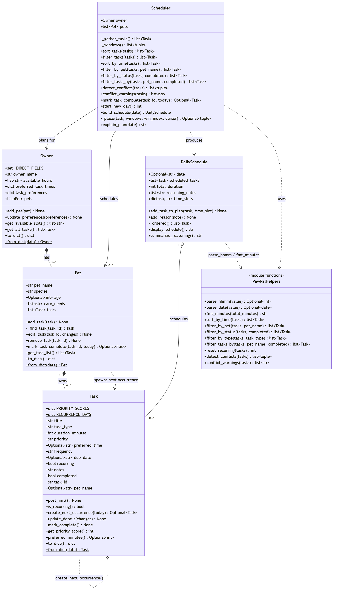

# PawPal+ (Module 2 Project)

You are building **PawPal+**, a Streamlit app that helps a pet owner plan care tasks for their pet.

## Scenario

A busy pet owner needs help staying consistent with pet care. They want an assistant that can:

- Track pet care tasks (walks, feeding, meds, enrichment, grooming, etc.)
- Consider constraints (time available, priority, owner preferences)
- Produce a daily plan and explain why it chose that plan

Your job is to design the system first (UML), then implement the logic in Python, then connect it to the Streamlit UI.

## What you will build

Your final app should:

- Let a user enter basic owner + pet info
- Let a user add/edit tasks (duration + priority at minimum)
- Generate a daily schedule/plan based on constraints and priorities
- Display the plan clearly (and ideally explain the reasoning)
- Include tests for the most important scheduling behaviors

## ✨ Features

The algorithms implemented in [`pawpal_system.py`](pawpal_system.py), each with a
unit test and a Streamlit UI surface:

- **Priority-first planning** — `Scheduler.sort_tasks()` orders tasks by priority (high → low), using preferred time then duration as tie-breakers.
- **Greedy time-slot packing** — `Scheduler.build_schedule()` packs tasks into the owner's real `HH:MM` availability windows with first-fit, assigns each a concrete start time, and never double-books a minute.
- **Sorting by time** — `Scheduler.sort_by_time()` returns tasks in chronological order (untimed tasks float to the end via a `"99:99"` sentinel).
- **Filtering** — `Scheduler.filter_tasks_by()` filters by pet, completion status, or both; `filter_by_type()` filters by task type.
- **Conflict warnings** — `Scheduler.conflict_warnings()` / `detect_conflicts()` flag tasks whose preferred-time ranges overlap (duration-aware), distinguishing same-pet clashes (impossible) from different-pet clashes (needs a helper).
- **Daily / weekly recurrence** — completing a recurring task auto-spawns its next occurrence with `datetime.timedelta` (daily → +1 day, weekly → +7 days); one-off tasks simply complete.
- **New-day roll-over** — `Scheduler.start_new_day()` / `reset_recurring()` brings recurring chores back to pending for a fresh day.
- **Reasoning / explainability** — every placement or skip is recorded, viewable via `DailySchedule.summarize_reasoning()`.
- **Persistence** — `to_dict()` / `from_dict()` round-trip the whole owner → pets → tasks tree to JSON so data survives refreshes and restarts.

## Getting started

### Setup

```bash
python -m venv .venv
source .venv/bin/activate  # Windows: .venv\Scripts\activate
pip install -r requirements.txt
```

### Suggested workflow

1. Read the scenario carefully and identify requirements and edge cases.
2. Draft a UML diagram (classes, attributes, methods, relationships).
3. Convert UML into Python class stubs (no logic yet).
4. Implement scheduling logic in small increments.
5. Add tests to verify key behaviors.
6. Connect your logic to the Streamlit UI in `app.py`.
7. Refine UML so it matches what you actually built.

## 🖥️ Sample Output

Paste a sample of your app's CLI or Streamlit output here so a reader can see what a generated plan looks like:

```
# e.g.:
# Daily plan for Biscuit (Golden Retriever):
#   08:00 — Morning walk (30 min) [priority: high]
#   09:00 — Feeding (10 min) [priority: high]
#   ...
```

<!-- ==================================================
  PawPal+  |  Jordan's pets: Biscuit, Mochi
==================================================
Daily plan for Today:
  08:00 — Biscuit — Morning walk (30 min) [priority: high]
  08:30 — Biscuit — Breakfast (10 min) [priority: high]
  08:40 — Mochi — Breakfast (10 min) [priority: high]
  08:50 — Mochi — Medication (5 min) [priority: medium]
  08:55 — Mochi — Play time (15 min) [priority: low]
  09:10 — Biscuit — Training (20 min) [priority: low]
  Total scheduled time: 90 min

Why this plan?
- Placed Biscuit's 'Morning walk' at 08:00 (priority: high, 30 min).
- Placed Biscuit's 'Breakfast' at 08:30 (priority: high, 10 min).
- Placed Mochi's 'Breakfast' at 08:40 (priority: high, 10 min).
- Placed Mochi's 'Medication' at 08:50 (priority: medium, 5 min).
- Placed Mochi's 'Play time' at 08:55 (priority: low, 15 min).
- Placed Biscuit's 'Training' at 09:10 (priority: low, 20 min).
- Scheduled 6 of 6 task(s), using 90 min of available time. -->

## 🧪 Testing PawPal+

Run the full test suite from the project root:

```bash
python -m pytest
```

Add `-v` for a per-test breakdown (`python -m pytest -v`), or target one file
(`python -m pytest tests/test_scheduler.py`).

### What the tests cover

The suite has **33 tests** across two files, covering both **happy paths**
(everything fits) and **edge cases** (empty, boundary, and malformed inputs):

- **Data model** — creating tasks, adding them to a pet, and marking them complete.
- **Sorting correctness** — `sort_by_time()` returns tasks in chronological order; `Scheduler.sort_tasks()` orders high-priority tasks first with time/duration as tie-breakers.
- **Filtering** — by pet, by completion status, by type, and combined.
- **Recurrence logic** — completing a daily/weekly task spawns the next occurrence with a correctly advanced due date (including across month/year boundaries); one-off tasks spawn nothing.
- **Conflict detection** — overlapping preferred times are flagged (duration-aware), including two tasks requested at the exact same time, with friendly same-pet vs. different-pet warnings.
- **Scheduling brain** — `build_schedule()` packs tasks into real `HH:MM` availability windows without double-booking, pools tasks across multiple pets, spills into later windows, and records reasoning for every placement or skip.
- **Edge cases** — a pet with no tasks, an owner with no availability, a task too long to fit, an exact-boundary fit, completed/zero-duration tasks, and malformed time strings — none of which crash.
- **Persistence** — `to_dict()` / `from_dict()` round-trips preserve pets, tasks, and stable IDs.

### Successful test run

```
============================= test session starts =============================
platform win32 -- Python 3.14.5, pytest-9.0.3, pluggy-1.6.0
rootdir: C:\Users\Francisco\Documents\CodePath Courses\Ai Engineering\Projects\PawPal+\ai110-module2show-pawpal-starter
plugins: anyio-4.13.0
collected 33 items

tests\test_pawpal.py ...................                                 [ 57%]
tests\test_scheduler.py ..............                                   [100%]

============================= 33 passed in 0.04s ==============================
```

### Confidence Level

**★★★★☆ (4 / 5)**

All 33 tests pass and cover every core behavior — sorting, recurrence, conflict
detection, greedy packing, and the key edge cases (empty pet, duplicate times,
too-long tasks, no availability). The logic layer is pure and deterministic, so
these results are trustworthy and repeatable. Held back from 5/5 because coverage
of the Streamlit UI layer (`app.py`) and time-zone / very-long-horizon recurrence
is still manual rather than automated. **The scheduling engine itself is
production-confident; the UI wiring is verified by hand.**

## 📊 System Design (UML)

The final class design, reconciled against [`pawpal_system.py`](pawpal_system.py).
Source: [`diagrams/uml_final.mmd`](diagrams/uml_final.mmd).



**Relationships:** `Owner` *composes* `Pet` (1 → 0..\*), `Pet` *composes* `Task`
(1 → 0..\*), `Scheduler` uses an `Owner` and its `Pet`s and **produces** a
`DailySchedule`, which *aggregates* the scheduled `Task`s. Completing a recurring
`Task` **spawns its next occurrence** (`Task.create_next_occurrence()` via
`Pet.mark_task_complete()`). The pure module-level helpers (time parsing, sorting,
filtering, conflict detection) are grouped as `PawPalHelpers` and reused by both
the `Scheduler` and the Streamlit UI.

## 📐 Smarter Scheduling

Beyond the core greedy planner, PawPal+ adds four "smart" behaviors. Each is a
small, pure, unit-tested function in [`pawpal_system.py`](pawpal_system.py) with
a thin `Scheduler` method wrapper, so the UI can use them without re-running the
whole planner. The table summarizes them; the subsections below explain each and
**name the method that implements it**.

| Feature | Method(s) | Notes |
|---------|-----------|-------|
| Task sorting | `Scheduler.sort_by_time()` → `sort_by_time()` | Chronological by preferred time; a `"HH:MM"` string key sorts as text, untimed tasks go last |
| Filtering | `Scheduler.filter_tasks_by()`, `filter_by_pet()`, `filter_by_status()` | Filter by pet name and/or completion status |
| Conflict handling | `Scheduler.conflict_warnings()` → `detect_conflicts()` | Duration-aware overlap on preferred times; returns warnings, never crashes |
| Recurring tasks | `Scheduler.mark_task_complete()` → `Task.create_next_occurrence()` | Completing a daily/weekly task spawns the next occurrence via `timedelta` |
| Sorting/planning (core) | `Scheduler.sort_tasks()`, `build_schedule()` | Priority-first ordering + greedy first-fit packing |

### 1. Sorting behavior — `Scheduler.sort_by_time()`

Orders tasks chronologically by their `preferred_time`. The key trick: a
zero-padded 24-hour `"HH:MM"` string sorts correctly as plain text
(`"08:00" < "09:15" < "17:30"`), so the lambda key is just the string itself,
with a `"99:99"` sentinel to push untimed tasks to the end. `O(n log n)`.

```python
scheduler.sort_by_time(owner.get_all_tasks())   # earliest preferred time first
```

### 2. Filtering behavior — `Scheduler.filter_tasks_by()`

Filters a task list by **pet name**, **completion status**, or both in one call
(each argument is optional; `None` means "don't filter on that field"). Backed by
the granular helpers `filter_by_pet()` and `filter_by_status()`. Returns a new
list and never mutates the input.

```python
scheduler.filter_tasks_by(tasks, pet_name="Biscuit")            # just Biscuit's tasks
scheduler.filter_tasks_by(tasks, completed=False)               # only pending tasks
scheduler.filter_tasks_by(tasks, "Biscuit", completed=True)     # Biscuit's done tasks
```

### 3. Conflict detection — `Scheduler.conflict_warnings()` / `detect_conflicts()`

`detect_conflicts()` finds pairs of tasks whose **preferred-time ranges overlap**
(duration-aware, not just exact start-time matches) using a sort-and-sweep with
an early break. `conflict_warnings()` wraps it in a lightweight, "warn-don't-crash"
layer that returns friendly strings and distinguishes a **same-pet** clash
(impossible) from a **different-pets** clash (okay only if someone helps). A
missing or malformed time is skipped, so it never raises.

```python
for warning in scheduler.conflict_warnings():
    print(warning)
# ⚠ Conflict: Biscuit's 'Morning walk' and 'Vitamins' overlap by 5 min
#   (wanted 08:00 & 08:00) — same pet — these can't happen at the same time.
```

### 4. Recurring task logic — `Scheduler.mark_task_complete()` / `Task.create_next_occurrence()`

Tasks carry a `frequency` (`"none"`/`"daily"`/`"weekly"`) and a `due_date`.
Completing a recurring task through `Scheduler.mark_task_complete()` (which
delegates to `Pet.mark_task_complete()`) automatically spawns a fresh next
occurrence via `Task.create_next_occurrence()`, advancing the due date with
`datetime.timedelta` (daily → +1 day, weekly → +7 days). One-off tasks simply
complete and spawn nothing.

```python
spawned = scheduler.mark_task_complete(task_id)     # daily task due 2026-07-12
# -> new occurrence due 2026-07-13, uncompleted, with a new task_id
```

## 🎬 Demo Walkthrough

### Main UI features (what a user can do)

Launch the app with `streamlit run app.py`. From the single page a user can:

- **Set their profile** (sidebar) — enter the owner name and one or more availability windows as `HH:MM-HH:MM` (e.g. `08:00-12:00, 17:00-20:00`).
- **Add pets** — name, species, and age; each becomes a real `Pet` on the owner.
- **Add tasks** to a chosen pet — title, type, duration, priority, an optional preferred time, and a repeat setting (`none` / `daily` / `weekly`).
- **Manage tasks** — tick a task **done** (a recurring one instantly spawns tomorrow's copy) or **remove** it.
- **Sort & filter** — a control row re-orders the task **table** by *preferred time* or *priority*, and filters by *pet* and *status*.
- **See conflict warnings** — overlapping preferred times are flagged inline (🔴 same-pet = must fix, 🟠 different-pet = needs a helper).
- **Generate today's schedule** — produces a timed **table**, a green success summary, and a "Why this plan?" reasoning panel.
- **Reset everything** — clears the saved data and starts fresh. All changes auto-save to `pawpal_data.json`, so they survive a refresh.

### Example workflow

1. In the sidebar, set availability to `08:00-12:00, 17:00-20:00`.
2. **Add a pet:** `Biscuit`, dog, age 4.
3. **Add a task:** `Morning walk`, walk, 30 min, **high** priority, preferred `08:00`, repeats **daily**.
4. **Add a second task** at the same time: `Vitamins`, medication, 5 min, high, preferred `08:00` → PawPal+ shows a **conflict warning**.
5. Open **Sort & filter**, choose *Sort by → Preferred time* to see the tasks chronologically in the table.
6. Click **Generate schedule** → the greedy packer places the walk at `08:00` and spaces the vitamins to `08:30` (no double-booking); the reasoning panel explains each choice.
7. Tick **Morning walk** done → because it's daily, a fresh occurrence appears **due tomorrow**.

### Key Scheduler behaviors shown

- **Sorting by time** (`sort_by_time`) and **priority-first** ordering (`sort_tasks`).
- **Filtering** by pet and status (`filter_tasks_by`).
- **Conflict warnings** for two tasks at the same time (`conflict_warnings`), same-pet vs. different-pet.
- **Greedy packing** into real clock windows with no double-booking (`build_schedule`).
- **Daily recurrence** — completing a daily task spawns the next day's occurrence (`mark_task_complete` → `create_next_occurrence`).

### Sample CLI output (`python main.py`)

`main.py` is a headless demo that drives the same logic layer — tasks are added
out of order, two share the `08:00` slot, and several are recurring:

```text
==============================================================
  Tasks as entered (out of order)
==============================================================
   18:00  Biscuit  Training       [low   ] · todo
   08:00  Biscuit  Morning walk   [high  ] · todo 🔁daily due 2026-07-12
   08:00  Biscuit  Vitamins       [high  ] · todo 🔁daily due 2026-07-12
   17:30  Mochi    Play time      [low   ] · todo
   08:15  Mochi    Breakfast      [high  ] · todo 🔁daily due 2026-07-12

==============================================================
  Feature 1 — Scheduler.sort_by_time() (chronological)
==============================================================
   08:00  Biscuit  Morning walk   [high  ] · todo 🔁daily due 2026-07-12
   08:00  Biscuit  Vitamins       [high  ] · todo 🔁daily due 2026-07-12
   08:15  Mochi    Breakfast      [high  ] · todo 🔁daily due 2026-07-12
   17:30  Mochi    Play time      [low   ] · todo
   18:00  Biscuit  Training       [low   ] · todo

==============================================================
  Feature 2 — Scheduler.filter_tasks_by()
==============================================================
Only Biscuit's tasks:
   18:00  Biscuit  Training       [low   ] · todo
   08:00  Biscuit  Morning walk   [high  ] · todo 🔁daily due 2026-07-12
   08:00  Biscuit  Vitamins       [high  ] · todo 🔁daily due 2026-07-12

==============================================================
  Feature 3 — Scheduler.conflict_warnings() (same-time detection)
==============================================================
  Found 2 conflict(s):
  ⚠ Conflict: Biscuit's 'Morning walk' and 'Vitamins' overlap by 5 min (wanted 08:00 & 08:00) — same pet — these can't happen at the same time.
  ⚠ Conflict: Biscuit's 'Morning walk' and Mochi's 'Breakfast' overlap by 10 min (wanted 08:00 & 08:15) — different pets — okay only if someone else can help.

==============================================================
  Feature 4 — Completing a recurring task spawns the next occurrence
==============================================================
Assume today is 2026-07-12.

  Completed 'Morning walk' (daily, due 2026-07-12) -> new occurrence due 2026-07-13.
  Completed 'Training' (none) — one-off, nothing respawned.
```
